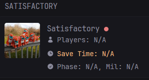

> [!NOTE]
> I'll probably not add the widget to the [community widgets](https://github.com/glanceapp/community-widgets) repo as I don't see my widget fit in there due to the need of an api middleman, the contributing documentation under that repo says that this repo kindof falls under the "extensions" categoty, but I see no extension widgets in there. This is a subject to change.

# What is this?

This is a simple widget for [glance](https://github.com/glanceapp/glance), for those who also host their own satisfactory server, this widget requires a "middleman" to change the game's api output into one that is easier for glance to understand.

# How the widget looks:

Server online with at least a single player joined:


<br>

<br>

Server online but no players online, and autopause is on:


<br>

<br>

Server is offline:



<br>

<br>

> The green/red dot doesn't indicate server online/offline but overall server health (tickrate > 10 per second), but including a screenshot for every possible state and hoverable part would make this readme a mess.

---

# Supported Versions:

The widget is tested on both python 3.10 and python 3.12, and the tested versions of the necessary imports are in the [requirements.txt](https://github.com/PR1NT3R/satisfactory-glance-widget/blob/main/requirements.txt) file (Older versions will probably work too).

I've been using this widget on the 1.1 experimental version of the game, [but the way I use to talk to the game's api](https://github.com/Jayy001/PyFactoryBridge) didn't change a bit since the stable version of the game (1.0), as my other, very simmiliar scripts work fine (the ones made on 1.0 work on 1.1).

# How to setup:
Change the values in the .env file as you wish, I recommend seperating ```SATISFACTORY_WIDGET_URL``` and ```SATISFACTORY_WIDGET_IMAGE_URL``` entries into a seperate .env for glance itself, then leave the rest for the script.

I also recommend setting up some kind of a cronjob on the host machine for this script to start on boot, least maintenance this way in my opinion (for example ```@reboot sleep 30; COMMAND```).

# Having issues or the script is broken?

Feel free to open an issue on this github repo!
> Assuming that I've properly set up this repo with my lack of knowledge about github haha.
